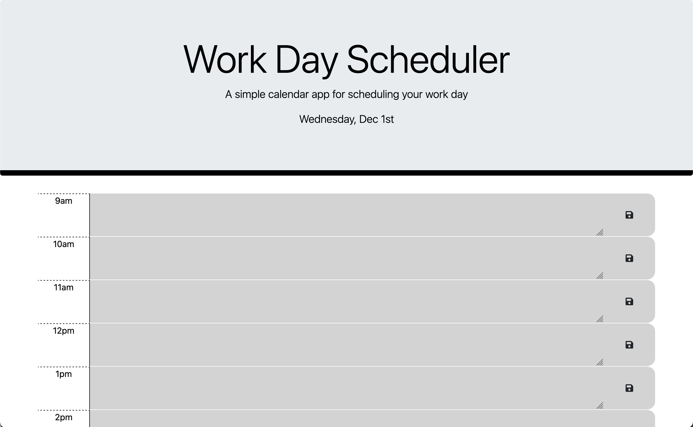

# WorkdayScheduler

## Description

I was primarily motivated by the fact that I wanted to build more complex application to run from a web browser.I built this project to have a better idea
of what it takes to develop a web application. It solves the issue of being able to organize your day from a web browser. I learned how to use bootstrap and jquery along with some javascript implementation.

## Installation
Clone repository in local machine. Launch and open in browser.

    ```

## License
This is covered by [MIT License](https://mit-license.org): 
---
## Deployed Applet
[](https://jjsr17.github.io/WorkdayScheduler/)
This is a screenshot with a link to the deployed applet.
